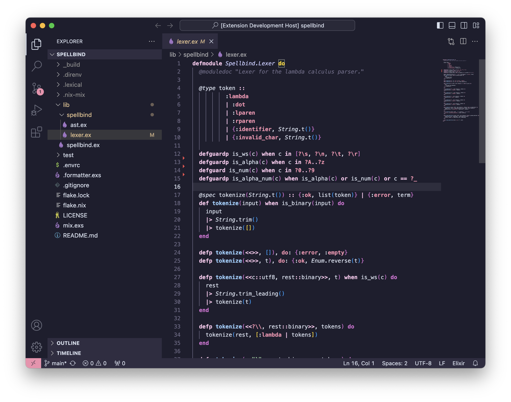
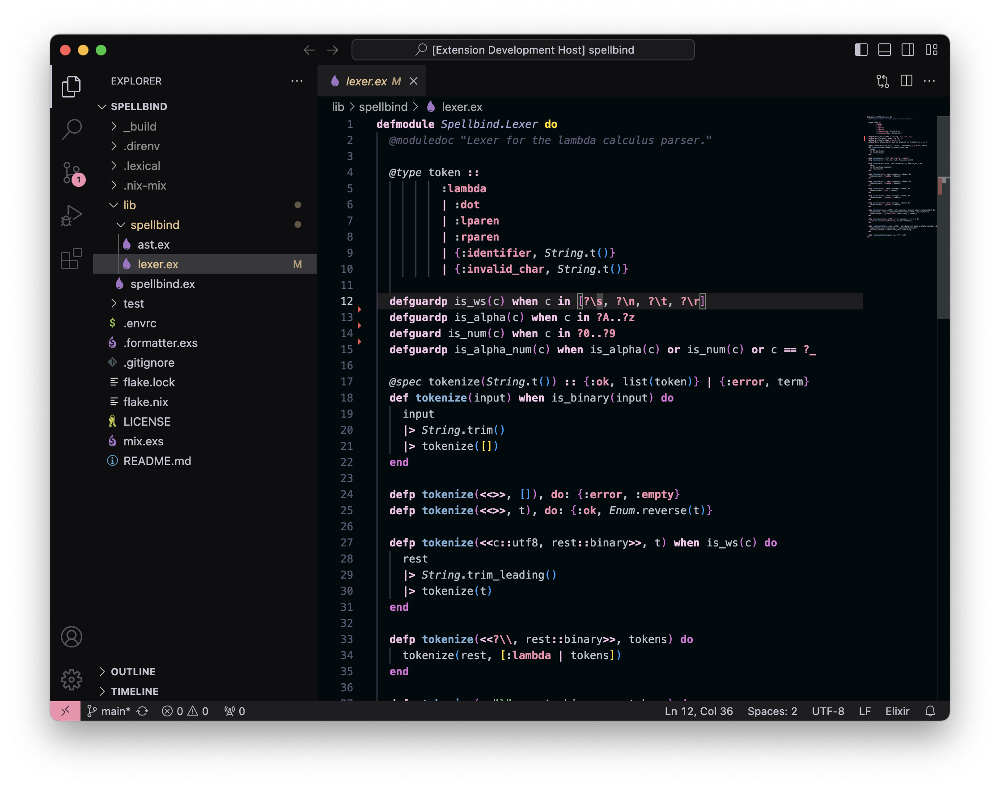
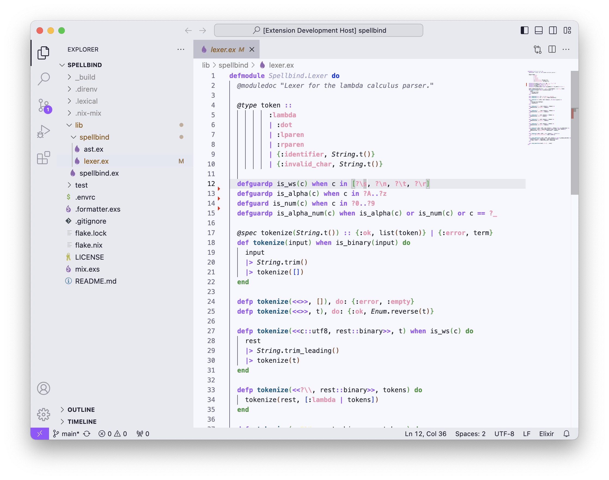

# nyxvamp (vscode)

a minimalist theme collection, inspired by a blend of gothic and emo aesthetics with transfem symbolism. it combines deep purples and soft yellows with neutral tones to create strong contrasts and a comfortable coding environment that reflects individuality.

## variations

1. **veil**: versatile theme for both day and night, featuring bright accents on a dark background.

2. **obsidian**: dark theme for focused nighttime coding sessions.

3. **radiance**: light theme optimized for daylight use, ensuring excellent readability.

## usage (manual)

1. clone this repo
2. place all files into the vscode extensions folder under `nyxvamp-theme`
 - unix: `~/.vscode/extensions/`
 - windows: `%AppData%\vscode/extensions\` - you dare it?
3. issue the theme
 - open vscode
 - start the cmd palette (ctrl + shift + p or cmd + shift + p)
 - issue the color theme picker
 - type NyxVamp and choose your variant

## contribution

if you have suggestions or improvements, feel free to contribute or reach out.
